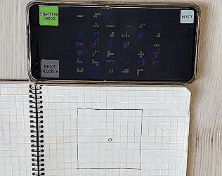

# THIRD OPTION
## Tetris on pen and paper!

In this puzzle game for 1 - 12 players, your goal is to fill a 9x9 grid as completely as possible with "Tetris shapes". Sit back, relax, and start drawing. 
In this game, you are free to take as much as time to think, strategize and color your beautiful shapes. 

Every turn, two puzzle tile cards are revealed, and each player chooses one of them. Players then mark off squares on their personal grid to match the shape of the image shown on their chosen card. Multiple players can choose the same card. If a player cannot fit either revealed shape into their grid, they receive a THIRD OPTION and reveal one card from the deck just for them. If this shape fits in their grid, they continue normally in the next round; otherwise, they are eliminated from play.

The game ends when all players have been eliminated, the deck of puzzle cards has run out, or a player has completely filled their grid. If someone has filled their grid, they win. If all players have been eliminated or the deck runs out of cards, the player with the fewest empty spaces wins.

## Features:

    Players: 1 - 12
    Playing time: 10 - 15 min

## What you need:

    Pen and paper

## How to play: 

### Quick instructions: 

1. Draw 9x9 grid with central dot.
2. Insert unique starting shape overlapping the dot.
3. Choose from 2 options to place shapes; rotate and mirror allowed.
4. If no shapes fit, get a THIRD OPTION. If it fits, continue. If not, eliminate player; first eliminated gets free 1x1 square. Count empty squares for score (lower is better).
5. Game ends when:
  a. No more shapes fit.
  b. Deck runs out.
  c. Grid fully filled (immediate win).

Winner: Least empty squares or first 100% filled grid.

### Full instructions:

1. Start by drawing a 9x9 square, with a small dot in the middle.

2. Insert your starting shape. The shape must overlap the dot in the middle. Each player will receive a unique starting shape.

3. When every player has received their starting shape, begin placing the puzzle shapes onto the grid. You can choose either one of the 2 options available. Feel free to rotate and mirror the shapes in any way you want. Remember to color your shapes creatively and take as much time as you need. :-)

4. Eventually, you may not be able to fit any more shapes onto the grid. When neither of the 2 options fit, you will be granted a THIRD OPTION. This option is unique to the player who cannot fit either of the regular shapes, and no other player can use that shape. If you manage to fit the third option onto your grid, you are back in the game, and you are even eligible for another third option in the next round, if none of those fit again. If you cannot fit the third option, you are out of the game. The first player eliminated will receive a free 1x1 square as a reward for playing aggressively. Once you are out, count the empty squares in your grid. This number will be your score, with lower scores being better.

5. The game will end when: 

     a. None of the players can fit more shapes, not even the third options.
     b. The deck runs out of cards.
     c. Someone successfully fills their 9x9 grid 100%. That player will immediately win.

The winner is the player with the least empty squares on their 9x9 grid or the player who first manages to fill their grid 100%.